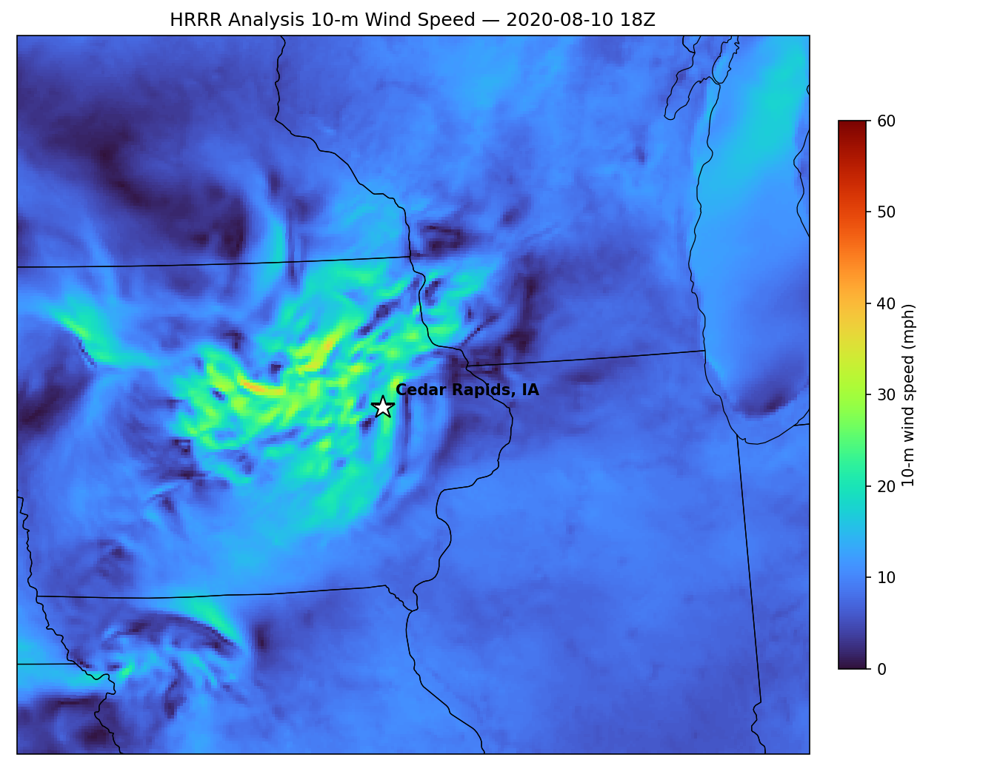

# A Storm's Appoaching: Creating your own Weather Forecast

A lot of people use our nation's operational weather forecasts every day, but few know how it actually works. This research shows that the complex processes inherent in understanding the weather don't need to be scary or inaccessible! With just a computer, a simple understanding of Python coding, and access to Github -- you too can be well on your way to understanding one of our nation's most important public services!

## Introduction
The National Oceanic and Atmospheric Administration (NOAA) and the National Weather Service (NWS) use complex numerical models to predict the weather. This work requires access to high-performance computers (HPCs), a strong understanding of Fortran, Python, Linux, Terminal/Shell scripting, and more! Also, to fully understand how the weather models operate, scientists need a meteorlogical background to know the complex atmospheric physics equations behind the model and how to read the forecast data that is output. This makes understanding our nation's weather forecasts out of reach for most people.

But did you know the code used to create our nation's weather forecasts is publicly available? One just needs to know how to access it! 

This small notebook will demonstrate how easy it is to access forecast data and get interesting visuals and data sets to look at.

## Area of Focus
This notebook focuses on the wind from a storm that occurred on August 10th, 2020 near Cedar Rapids, Iowa. However, it is important to note that once this data is downloaded, you could look at any location in the U.S. at any time period. There are also other data that could be analyzed such as temperature, dewpoint, accumulated precipitation, snow cover, and more!

## Research Findings
Our nation has so much weather data available, right under our noses! We just have to know how to access it. This notebook shows you that you can access high quality weather data without using an expensive computer or spending hours coding in a language you don't understand. 

  
  
This is important because the data used for our nation's forecasts is constantly being improved, and it's publicly available -- so you can improve how these models run too!

## Implications and Future Work
This project currently just pulls from archived weather forecast models. Ideally, users would be able to run their own model and modify it directly in their python notebook.

## Acknowledgements

Data collected https://registry.opendata.aws/noaa-hrrr-pds/ with special help from Herbie